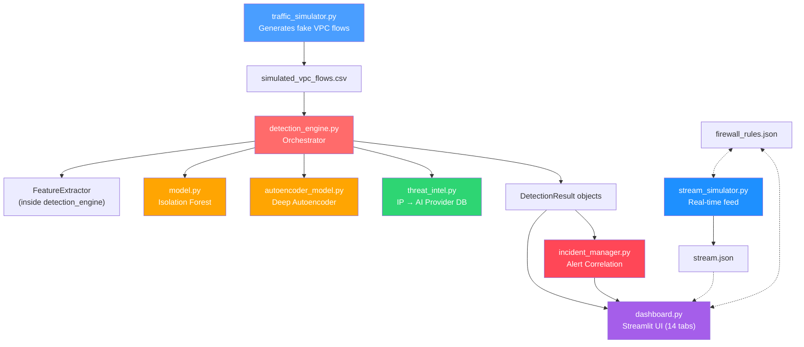
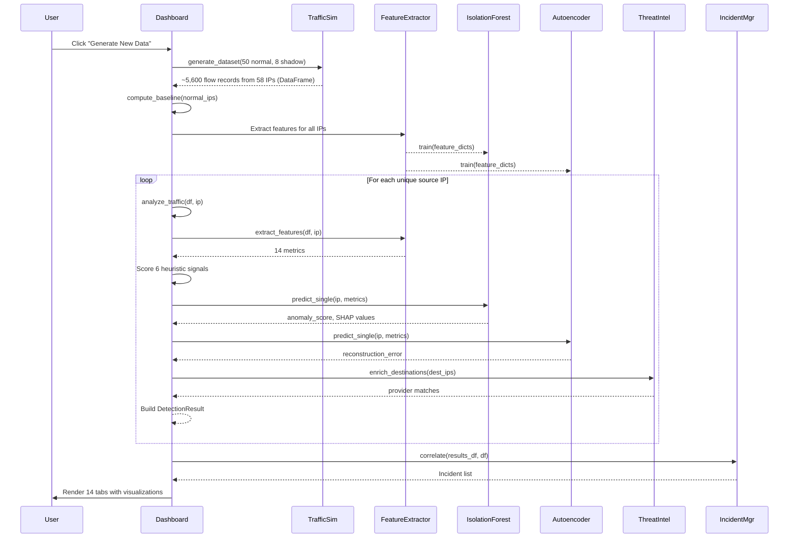

# 🕵️ Shadow Hunter MVP — Complete Deep-Dive Walkthrough

> Every module, every function, every grain of how this project works.

---

## 📐 Architecture at a Glance



---

## 🔢 File Inventory

| File | Lines | Purpose |
|---|---|---|
| [traffic_simulator.py](file:///c:/Users/sneha/shadow-hunter-mvp/traffic_simulator.py) | 338 | Generates 5 types of simulated network traffic (Fleet Mode) |
| [detection_engine.py](file:///c:/Users/sneha/shadow-hunter-mvp/detection_engine.py) | 591 | Central orchestrator — heuristics + ML + AE + TI |
| [model.py](file:///c:/Users/sneha/shadow-hunter-mvp/model.py) | 228 | Isolation Forest anomaly detector + SHAP |
| [autoencoder_model.py](file:///c:/Users/sneha/shadow-hunter-mvp/autoencoder_model.py) | 217 | Neural-network autoencoder via sklearn MLPRegressor |
| [threat_intel.py](file:///c:/Users/sneha/shadow-hunter-mvp/threat_intel.py) | 141 | Maps IPs to known AI service providers |
| [incident_manager.py](file:///c:/Users/sneha/shadow-hunter-mvp/incident_manager.py) | 227 | Correlates alerts into incidents |
| [dashboard.py](file:///c:/Users/sneha/shadow-hunter-mvp/dashboard.py) | 1559 | Streamlit dashboard — 14 tabs |
| [stream_simulator.py](file:///c:/Users/sneha/shadow-hunter-mvp/stream_simulator.py) | 138 | Real-time flow stream writer |
| [validate_detection.py](file:///c:/Users/sneha/shadow-hunter-mvp/validate_detection.py) | 261 | Validation + performance benchmarking |
| [test_features.py](file:///c:/Users/sneha/shadow-hunter-mvp/test_features.py) | 93 | Integration test for all 4 advanced features |
| [test_ml.py](file:///c:/Users/sneha/shadow-hunter-mvp/test_ml.py) | 27 | Smoke test for ML pipeline |
| [firewall_rules.json](file:///c:/Users/sneha/shadow-hunter-mvp/firewall_rules.json) | 15 | Persisted firewall block/allow rules |
| [requirements.txt](file:///c:/Users/sneha/shadow-hunter-mvp/requirements.txt) | 11 | Python dependencies |
| [simulated_vpc_flows.csv](file:///c:/Users/sneha/shadow-hunter-mvp/simulated_vpc_flows.csv) | ~5,600+ rows | Pre-generated labeled traffic dataset (58 unique IPs) |

---

## 1️⃣ `traffic_simulator.py` — The Data Factory

### What it does
Generates **realistic VPC (Virtual Private Cloud) Flow Log data** — the kind of data a cloud provider like AWS/GCP would produce. It creates **5 distinct traffic patterns**, each mimicking a specific service type, so the detector has something to train on and validate against.

### Class: `TrafficSimulator`

Initialized with a `start_time` and `duration_minutes`. Maintains a `current_time` cursor that advances with each generated flow record.

### The 5 Traffic Generators

| Method | Simulates | Key Signature | RX/TX Ratio |
|---|---|---|---|
| `generate_shadow_ai_traffic()` | **Unauthorized LLM API calls** (OpenAI, Anthropic) | Small TX (500–2000B), large RX (5–50KB), 8–15s intervals, port 443 | **10:1 to 50:1** |
| `generate_normal_api_traffic()` | REST API CRUD operations | Balanced TX/RX (~1–8KB), bursty timing, ports 80/443/8080 | **~1:1 to 1:3** |
| `generate_video_streaming()` | Netflix/YouTube/Zoom | Tiny TX (100–500B), massive RX (100KB–1MB), continuous | **200:1 to 10000:1** |
| `generate_websocket_traffic()` | Slack/chat apps | Small bidirectional (200–1000B), long-lived, regular heartbeats | **~1:1** |
| `generate_database_traffic()` | PostgreSQL queries | Small queries (200–1500B), variable results, very fast (<0.5s), port 5432 | **~3:1 to 7:1** |

### Each flow record contains 8 fields:
`timestamp`, `source_ip`, `destination_ip`, `destination_port`, `protocol`, `bytes_sent`, `bytes_received`, `packet_count`, `connection_duration`

### The `generate_dataset()` function — Fleet Mode

Builds a **fleet-scale** labeled dataset using a persona system. Each normal user is randomly assigned one of 5 traffic profiles:

| Persona | Traffic Generator | Flows per IP |
|---|---|---|
| `api_heavy` | `generate_normal_api_traffic()` | 80–150 |
| `video_watcher` | `generate_video_streaming()` | 20–50 |
| `chatter` | `generate_websocket_traffic()` | 60–120 |
| `db_heavy` | `generate_database_traffic()` | 100–200 |
| `mixed` | API + WebSocket combined | 70–140 |

**Default fleet composition:**
- **50 normal users** (`10.0.1.10` – `10.0.1.59`) — random persona each → **~4,900 flows**
- **8 shadow AI users** (`10.0.2.10` – `10.0.2.17`) — 60–120 flows each → **~700 flows**
- **Total: ~5,600 flows from 58 unique IPs**, saved to `simulated_vpc_flows.csv`

This gives the ML models (Isolation Forest, Autoencoder, SHAP) enough diverse training samples to learn meaningful patterns — previously only 5 IPs existed, which was too few.

> [!IMPORTANT]
> The key insight: **Shadow AI traffic has a unique fingerprint** — a specific RX/TX ratio range (10:1 to 50:1) that sits *between* normal API traffic (~1:1) and video streaming (>200:1). This is the primary detection signal.

---

## 2️⃣ `detection_engine.py` — The Orchestrator Brain

This is the **central nervous system**. It ties together heuristics, ML, deep learning, and threat intelligence into a single detection pipeline.

### Dataclass: `DetectionConfig`

Configurable thresholds for every signal. Key defaults:

| Parameter | Default | Purpose |
|---|---|---|
| `rx_tx_ratio_min` | 12.0 | Min RX/TX ratio to flag (DB traffic ~6.3, AI ~22.9) |
| `rx_tx_ratio_max` | 100.0 | Max — beyond this it's video |
| `min_bytes_received` | 2000 | At least 2KB response |
| `max_bytes_received` | 100000 | Less than 100KB (video is higher) |
| `connection_duration_min` | 1.0s | LLM streaming takes time |
| `connection_duration_max` | 30.0s | But not too long |
| `timing_regularity_threshold` | 0.4 | Automated agents are regular |
| `alert_threshold` | 85 | Score to trigger alert |
| `whitelisted_db_ports` | [3306, 5432, 1433, ...] | Skip known DB traffic |

### Class: `FeatureExtractor`

**Static method** `extract_features(df, source_ip)` — aggregates all traffic for one IP into 14 derived metrics:

| Feature | How It's Computed |
|---|---|
| `rx_tx_ratio` | `total_received / total_sent` |
| `total_bytes_sent/received` | Raw sums |
| `avg_bytes_sent/received` | Means per flow |
| `avg_connection_duration` | Mean duration |
| `max_connection_duration` | Max duration |
| `packets_per_second` | `total_packets / total_duration` |
| `avg_packet_size` | `(total_sent + total_received) / total_packets` |
| `request_count` | Number of flow records |
| `requests_per_minute` | Count / time window |
| `unique_destinations` | Distinct destination IPs |
| `unique_ports` | Distinct destination ports |
| `external_https_ratio` | Fraction of flows to non-`10.x` IPs on port 443 |
| `timing_regularity` | `1 / (1 + coefficient_of_variation)` of inter-flow intervals |

### Class: `ShadowAIDetector` — The Main Detector

Instantiated with a `DetectionConfig`. Internally holds:
- `self.ml_detector` → `ShadowAnomalyDetector` (Isolation Forest)
- `self.autoencoder` → `ShadowAutoencoder` (neural net)
- `self.threat_intel` → `ThreatIntelEnricher` (IP lookup)

#### `compute_baseline(df, normal_ips)`
Extracts features for each known-normal IP and computes population-level stats (`rx_tx_ratio_mean/std`, `pps_mean/std`, `duration_mean`). Used later for comparison context in alerts.

#### `analyze_traffic(df, source_ip)` → `DetectionResult` — **The Core Pipeline**

This is where everything converges. Step by step:

**Step 0: DB Port Whitelist Filter**
If >80% of an IP's traffic goes to known database ports (MySQL, Postgres, etc.), it's immediately classified as normal. This prevents DB servers from being flagged.

**Step 1–6: Six Heuristic Signals (100-point scale)**

| # | Signal | Points | Condition |
|---|---|---|---|
| 1 | **RX/TX Ratio** | 40 | Ratio between 12.0 and 100.0 |
| 2 | **Response Volume** | 20 | Avg bytes received 2KB–100KB |
| 3 | **Connection Duration** | 15 | Avg duration 1–30 seconds |
| 4 | **Packet Rate** | 10 | 3–100 packets/sec |
| 5 | **Timing Regularity** | 10 | Regularity score ≥ 0.4 |
| 6 | **External HTTPS** | 5 | >50% traffic to external HTTPS |

**Step 7: ML Anomaly Boost**
If the Isolation Forest flags it as anomaly but heuristics didn't reach threshold → **+15 points** boost. This catches edge cases the heuristics miss.

**Step 8: Autoencoder Results**
Stores reconstruction error, anomaly flag, percentile, and per-feature errors in metrics dict.

**Step 9: Threat Intelligence Enrichment**
Looks up all destination IPs against the AI provider database. If there's a match, identifies the specific provider (e.g., "OpenAI", "Anthropic") and updates the recommendation with confirmed provider info.

**Step 10: SHAP Values**
If available from the ML model, stores per-feature SHAP attributions for explainability.

**Step 11: Build Result**
Returns a `DetectionResult` with: `total_score`, `is_shadow_ai`, `confidence` (High/Medium/Low), `signals` list, full `metrics` dict, and `recommendation` string.

#### `train_ml_model(df, all_ips)` and `train_autoencoder(df, all_ips)`
Extract features for every IP, then call the respective model's `train()`. Need minimum 3 data points.

---

## 3️⃣ `model.py` — Isolation Forest (ML Layer)

### What it does
Wraps scikit-learn's **Isolation Forest** for unsupervised anomaly detection. No labels needed — it learns what "normal" looks like and flags outliers.

### How Isolation Forest works (conceptually)
1. Randomly selects a feature and a split value
2. Recursively partitions data into trees
3. **Anomalies are isolated quickly** (few splits) because they're different from the majority
4. Normal points take many splits to isolate

### The 9 features it operates on:
`rx_tx_ratio`, `avg_bytes_sent`, `avg_bytes_received`, `avg_connection_duration`, `packets_per_second`, `timing_regularity`, `external_https_ratio`, `requests_per_minute`, `unique_destinations`

### Training (`train()`)
1. Builds a DataFrame from feature dicts, selects the 9 features
2. **StandardScaler** normalizes each feature to zero mean, unit variance
3. Fits `IsolationForest(contamination=0.15, n_estimators=200)`
4. Initializes a **SHAP TreeExplainer** for feature attribution (if `shap` library is installed)

### Prediction (`predict_single()`)
1. Scales the input using the trained scaler
2. `model.predict()` → `-1` (anomaly) or `1` (normal)
3. `model.decision_function()` → continuous score (lower = more anomalous)
4. Computes **z-score contributions** per feature (how far each feature deviates from training mean)
5. Computes **SHAP values** for exact feature attributions
6. Returns `AnomalyResult` with all of the above

### SHAP Explainability
- Uses `shap.TreeExplainer` (exact, not approximate)
- Produces per-feature SHAP values explaining *how much each feature contributed* to this specific prediction
- Positive SHAP → pushes toward anomaly; Negative → pushes toward normal

---

## 4️⃣ `autoencoder_model.py` — Deep Learning Layer

### What it does
A second, independent anomaly detector using **autoencoder** architecture. Captures **non-linear feature interactions** that Isolation Forest might miss.

### How an autoencoder works
1. **Encoder**: Compresses 9 features → 64 → 16 → **4** neurons (bottleneck)
2. **Decoder**: Reconstructs back 4 → 16 → 64 → 9 features
3. During training, it learns to reconstruct "normal" traffic patterns accurately
4. **Anomalies have high reconstruction error** — the model can't reproduce unusual patterns it hasn't seen

### Architecture
```
Input(9) → Dense(64, ReLU) → Dense(16, ReLU) → Dense(4, ReLU) → Dense(16, ReLU) → Dense(64, ReLU) → Output(9)
```
The bottleneck of 4 neurons forces the model to learn a **compressed representation** of normal traffic.

### Implementation
Uses sklearn's `MLPRegressor` (avoids PyTorch dependency). Trained with:
- **Target = Input** (autoencoder trains to reconstruct its own input)
- Adam optimizer, adaptive learning rate (0.001)
- Up to 500 iterations, early stopping if dataset is large enough

### Threshold Calculation
After training, computes reconstruction error (MSE) for every training sample. Sets threshold at the **(1 − contamination) percentile** (default: 85th percentile). Anything above this threshold is flagged.

### Prediction (`predict_single()`)
1. Scales input, feeds through the network
2. Computes per-feature squared error: `(input − reconstruction)²`
3. Total error = mean of per-feature errors
4. Computes percentile ranking against training errors
5. Returns `AutoencoderResult` with all details

---

## 5️⃣ `threat_intel.py` — AI Provider Intelligence

### What it does
Maps destination IP addresses to **known AI service providers** using a CIDR-based lookup database. Tells you *exactly which AI service* is being used.

### The Threat Intel Database

| CIDR Range | Provider | Service | Risk Level |
|---|---|---|---|
| `13.107.42.0/24` | OpenAI | GPT-4 / ChatGPT API | CRITICAL |
| `13.107.43.0/24` | OpenAI | GPT-4 Turbo API | CRITICAL |
| `40.119.0.0/16` | OpenAI (Azure) | Azure OpenAI Service | HIGH |
| `34.102.136.0/24` | Anthropic | Claude 3.5 Sonnet API | CRITICAL |
| `34.102.137.0/24` | Anthropic | Claude API | CRITICAL |
| `142.250.0.0/16` | Google | Gemini / Vertex AI | HIGH |
| `54.164.0.0/16` | Hugging Face | Inference API / Hub | HIGH |
| `104.18.0.0/16` | Stability AI | Stable Diffusion API | MEDIUM |
| `35.203.0.0/16` | Cohere | Embed / Generate API | HIGH |
| `44.226.0.0/16` | Replicate | Model Hosting | MEDIUM |
| `51.159.0.0/16` | Mistral AI | Mistral Large / Le Chat | HIGH |

### How it works
1. On init, pre-parses all CIDR strings into `ipaddress.ip_network` objects
2. `lookup(ip)` → checks if the IP falls within any known range → returns `ThreatIntelMatch`
3. `enrich_destinations(ips)` → batch lookup, returns only matches
4. Each match includes: `provider`, `service`, `risk_level`, `category`, `data_risk` description, `compliance_tags` (GDPR, SOC2, HIPAA)

> [!NOTE]
> The simulator intentionally generates Shadow AI traffic to IPs `13.107.42.14` and `34.102.136.180`, which fall within the OpenAI and Anthropic CIDR ranges respectively. This ensures threat intel matches work in the demo.

---

## 6️⃣ `incident_manager.py` — Alert Correlation

### What it does
Groups individual detection alerts into **logical Incidents** — coherent attack narratives rather than isolated events.

### Data Model

**Alert** = single detection event: source IP, timestamp, score, confidence, triggered signals, threat intel match, ML/AE flags.

**Incident** = correlated group of alerts: incident ID, title, severity, status, source IPs, kill chain stages, IoC summary, recommended actions, tags.

### Correlation Rules

| Rule | Logic |
|---|---|
| **IP Clustering** | Multiple alerts from same IP → merged into one incident |
| **Score Escalation** | Score ≥ 90 + ML+AE agreement → CRITICAL |
| **Kill Chain Mapping** | Maps signal names → kill chain stages |
| **Threat Intel Boost** | Known AI provider → severity bump |

### Kill Chain Mapping

| Detection Signal | Kill Chain Stage |
|---|---|
| External HTTPS | Reconnaissance |
| RX/TX Ratio | Exploitation |
| Response Volume | Exploitation |
| Connection Duration | Command & Control |
| Packet Rate | Command & Control |
| Timing Regularity | Persistence |

### Severity Computation

| Condition | Severity |
|---|---|
| Score ≥ 90 AND ML+AE agree AND threat intel match | **CRITICAL** |
| Score ≥ 90 OR ML+AE agree | **CRITICAL** |
| Score ≥ 80 OR threat intel match | **HIGH** |
| Score ≥ 70 | **MEDIUM** |
| Otherwise | **LOW** |

### Tags auto-assigned
- `ML-Confirmed` — Isolation Forest flagged it
- `DL-Confirmed` — Autoencoder flagged it
- `ThreatIntel-Match` — known AI provider
- `Kill-Chain-Progression` — ≥3 kill chain stages detected

---

## 7️⃣ `dashboard.py` — The Streamlit UI (1559 lines)

### Startup Flow
1. **Sidebar**: Configure alert threshold, RX/TX ratio min, choose data source (generate or upload CSV)
2. On "Generate New Data" → calls `generate_dataset()` from traffic simulator
3. Computes baseline from normal IPs
4. **Trains both ML models** (Isolation Forest + Autoencoder)
5. Runs `analyze_traffic()` on every unique source IP
6. Builds a `results_df` DataFrame with all detection results
7. Computes precision, recall, accuracy metrics

### The 14 Tabs

| # | Tab | What It Shows |
|---|---|---|
| 1 | 🎯 Detections | Per-IP expandable cards with signal breakdown, metrics, recommendation |
| 2 | 📊 Analysis | Score histogram, traffic timelines, duration distributions, RX/TX scatter, heatmap, packet rate analysis, service breakdown |
| 3 | 🔍 Details | Raw flow data per IP, flow timeline scatter |
| 4 | ⚙️ Signals | Signal configuration table (weights + thresholds), weight bar chart |
| 5 | 🧠 ML Insights | Isolation Forest score distribution, heuristic vs ML score scatter, per-anomaly feature contribution bar charts |
| 6 | 🌐 Topology | NetworkX-based graph: nodes = IPs (colored by type), edges = traffic flows |
| 7 | ⚔️ Kill Chain | Maps each detected threat to 6 kill chain stages with progress bars |
| 8 | 🛡️ Response (SOAR) | Block/unblock IPs via `firewall_rules.json`, one-click block-all, incident report generator (downloadable Markdown) |
| 9 | 🧩 Deep Learning | Autoencoder reconstruction error distribution, heuristic vs AE scatter, per-feature reconstruction errors, **model agreement analysis** (IF vs AE concordance) |
| 10 | 💬 Analyst | Chatbot interface — uses Google Gemini API if `GOOGLE_API_KEY` is set, otherwise falls back to rule-based analysis |
| 11 | 🔍 Threat Intel | Shows which IPs matched known AI providers, risk levels, compliance impact, provider distribution pie chart |
| 12 | 🚨 Incidents | Runs `IncidentManager.correlate()`, shows incidents sorted by severity with kill chain stages, IoC summaries, recommended actions |
| 13 | 📊 SHAP | Global feature importance bar chart, per-IP SHAP waterfall charts, detected vs normal SHAP comparison |
| 14 | 🗺️ Risk Heatmap | Multi-dimensional risk matrix (detection score + ML + AE + threat intel boosts), normalized heatmap, risk score ranking bar chart |

### The Shadow Analyst (Tab 10)

Two modes:
- **Gemini-powered**: If `GOOGLE_API_KEY` or `GEMINI_API_KEY` env var is set, sends full detection context to `gemini-2.0-flash` with a SOC analyst system prompt
- **Rule-based fallback**: Pattern-matches user question against keywords (IP addresses, "summarize", "remediate", "model") and returns pre-structured Markdown responses

---

## 8️⃣ `stream_simulator.py` — Real-Time Feed

### What it does
Simulates a **live VPC Flow Log stream** by writing flow records to `stream.json` at configurable intervals. Designed to work alongside the dashboard for live demos.

### How it works
1. Pre-generates pools of normal traffic (API + WebSocket) and optionally attack traffic
2. Every `interval` seconds (default 0.5s), pops flows from the pools and appends to `stream.json`
3. **Attack injection**: If `--attack` flag is set, Shadow AI traffic from `10.0.1.200` appears at the midpoint
4. **Firewall integration**: Reads `firewall_rules.json` each tick — if an IP is blocked, its traffic is skipped (simulates real firewall enforcement)
5. Runs for `duration` seconds (default 120s), then stops

### Usage
```bash
python stream_simulator.py                    # Normal traffic only
python stream_simulator.py --attack           # Inject attack at midpoint
python stream_simulator.py --interval 1.0 --duration 60  # Custom timing
```

---

## 9️⃣ Supporting Files

### `validate_detection.py`
End-to-end validation suite that:
1. Generates dataset
2. Validates behavioral assumptions (RX/TX ratios, packet sizes, durations)
3. Runs detector and calculates TP/FP/TN/FN + precision/recall/accuracy
4. Shows detailed explanations for one shadow AI and one normal IP
5. Exports detection configuration summary

### `test_features.py`
Integration test that exercises all 4 advanced features:
1. **Threat Intelligence** — verifies IP → provider matching
2. **Incident Correlation** — verifies incident creation and tagging
3. **SHAP Explainability** — verifies SHAP values are produced
4. **Risk Scores** — verifies multi-dimensional risk computation

### `test_ml.py`
Smoke test for the basic ML pipeline: generate → train → predict → show scores.

### `firewall_rules.json`
Persisted state file. Currently contains one rule blocking `10.0.1.100` (detected Shadow AI with score 100). The dashboard reads/writes this file, and the stream simulator respects it.

### `requirements.txt`
Dependencies: pandas, numpy, streamlit, plotly, scikit-learn, matplotlib, seaborn, networkx, fpdf2, shap, google-generativeai.

---

## 🔄 Complete Data Flow

Here's exactly what happens when you click **"Generate New Data"** in the dashboard:



---

## 🧮 The Scoring Math

For a source IP to be flagged as **Shadow AI**, it needs **≥ 85 points** (configurable):

```
Total Score = RX/TX (40) + Volume (20) + Duration (15)
            + Packet Rate (10) + Regularity (10) + Ext HTTPS (5)
            + ML Boost (up to 15 if heuristics borderline)

Maximum possible: 100 + 15 = 115 (capped at 100)
```

A typical Shadow AI IP from the simulator scores:
- ✓ RX/TX Ratio ~22:1 → **40 pts**
- ✓ Avg bytes received ~27KB → **20 pts**
- ✓ Avg connection duration ~5s → **15 pts**
- ✓ Packets/sec ~12 → **10 pts**
- ✓ Timing regularity ~0.84 → **10 pts**
- ✓ 100% external HTTPS → **5 pts**
- = **100/100** → 🚨 SHADOW AI DETECTED

A typical normal API IP:
- ✗ RX/TX Ratio ~1.7:1 → **0 pts** (below 12.0 threshold)
- → immediately can't reach 85 → **✅ Normal**

---

## 🔑 Key Design Decisions

1. **Multi-signal detection** — No single feature triggers an alert. The 85-point threshold requires multiple signals to agree, reducing false positives.

2. **Hybrid approach** — Heuristics provide interpretable baseline scoring; ML models catch non-linear patterns; threat intel confirms specific providers. Three independent "brains" working together.

3. **Explainability everywhere** — Every detection comes with: signal breakdown, z-score contributions, SHAP values, per-feature reconstruction errors, and natural language recommendation. This is critical for SOC analysts who need to understand *why* something was flagged.

4. **DB port whitelisting** — Database traffic (PostgreSQL at port 5432) is auto-excluded because its RX/TX ratio (~6.3:1) can be close enough to cause false positives.

5. **Video streaming exclusion** — Video has even higher RX/TX ratios (200:1+) but the `rx_tx_ratio_max` of 100.0 and `max_bytes_received` of 100KB exclude it because video responses are orders of magnitude larger than LLM responses.

6. **SOAR integration** — The dashboard can write firewall rules that the stream simulator reads, creating a closed-loop: detect → block → stop traffic.
